# Vehicle Service Log App

## Introduction
A simple Android app built with Jetpack Compose, Room, and MVVM architecture to manage and track vehicle service logs.

## Features
- Add, view, and update service logs for different vehicles.

## Screenshots
<details>
  <summary>Click to expand</summary>
  
### Main Screen
<p align="center">
  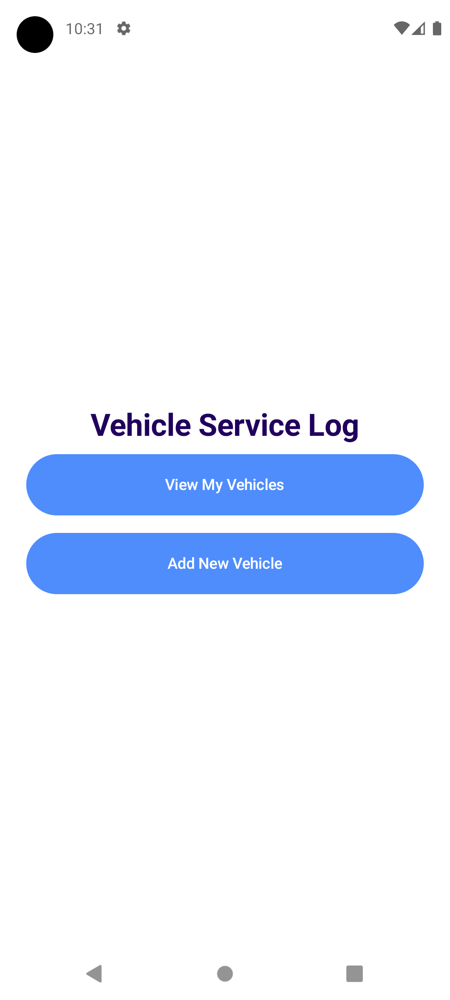
</p>

### Vehicle Screens
<p align="center">
  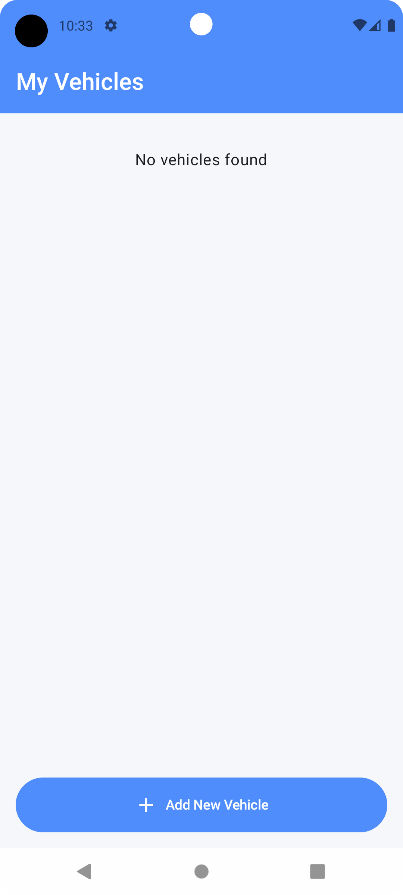
  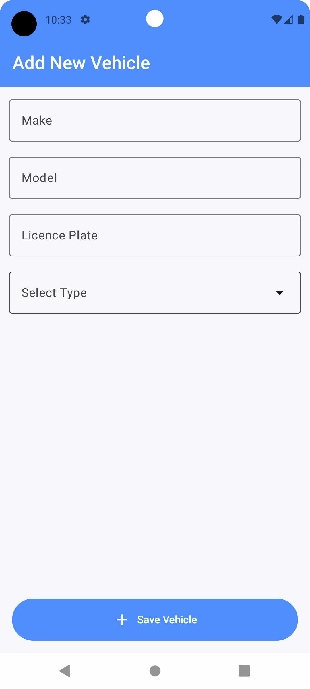
  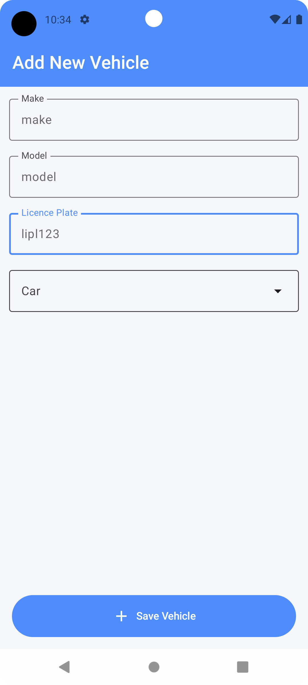
  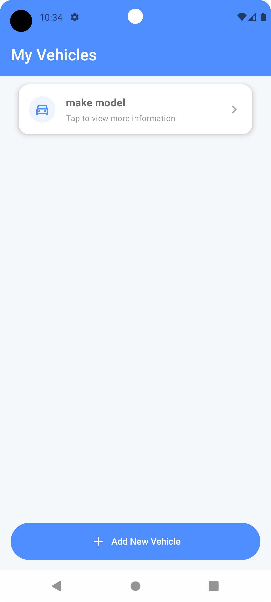
  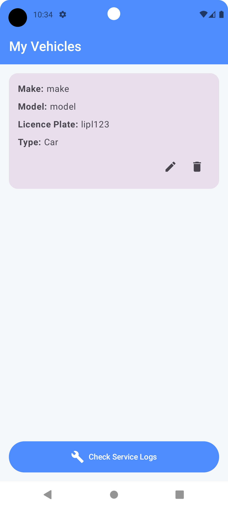
  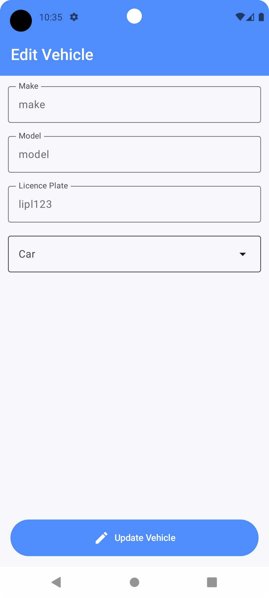
  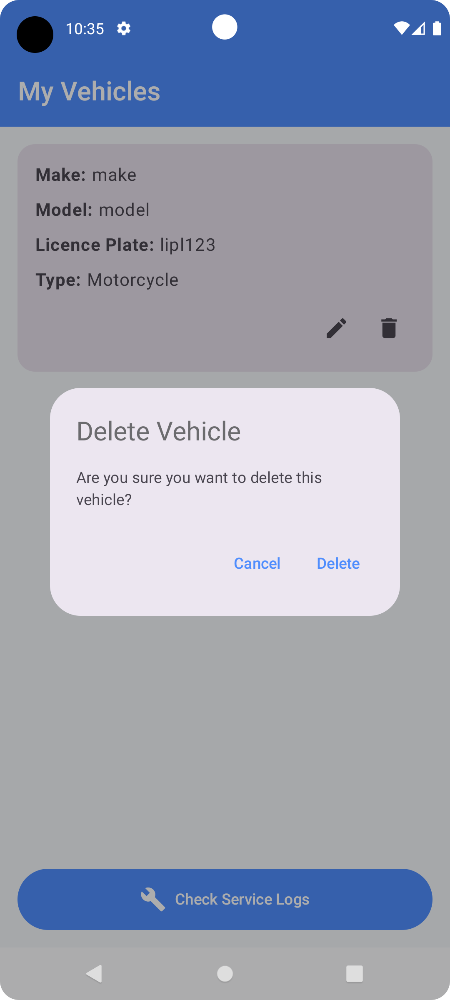
</p>

### Log Screens
<p align="center">
  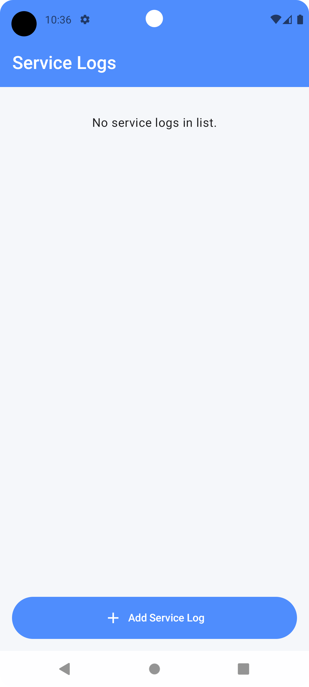
  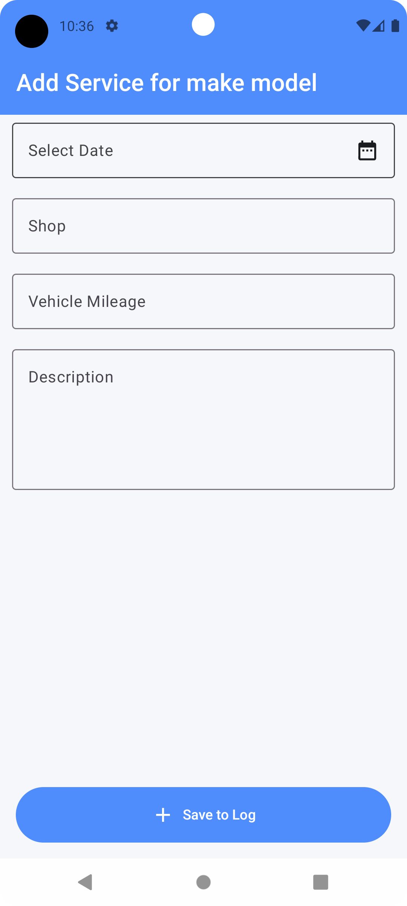
  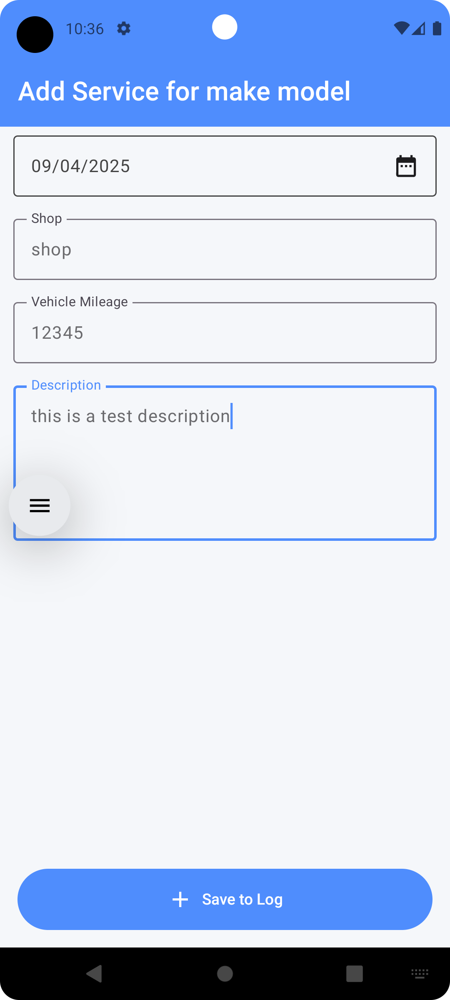
  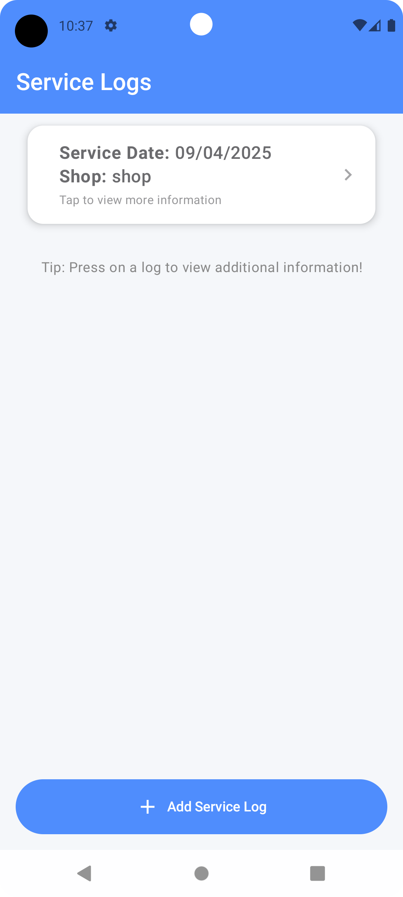
  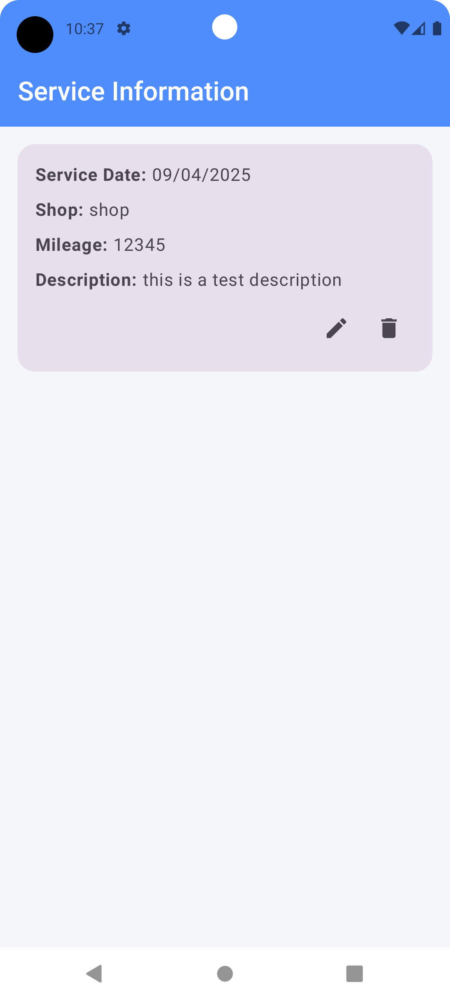
  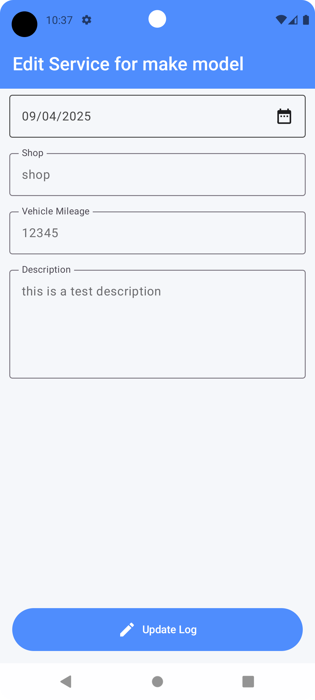
  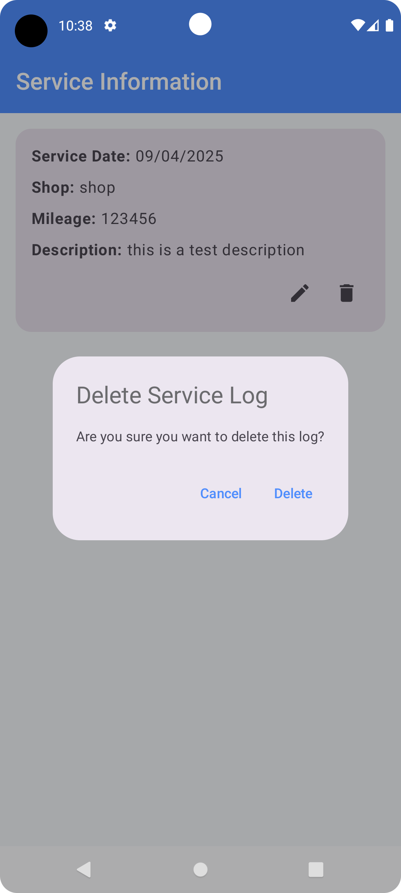
</p>

</details>

## Installation
1. Clone the repository:
```bash
git clone https://github.com/Buffito/vehicle-service-log.git
```
2. Open the project in Android Studio.
3. Build and run the app on an emulator or physical device.

## Usage
- Navigate to the "Vehicle List" to view and manage vehicles.
- Tap on a log for detailed information.

## Architecture
- **Jetpack Compose** for UI.
- **Room Database** for local data persistence.
- **MVVM Pattern** for separation of concerns.
- **Dagger Hilt** for dependency injection.